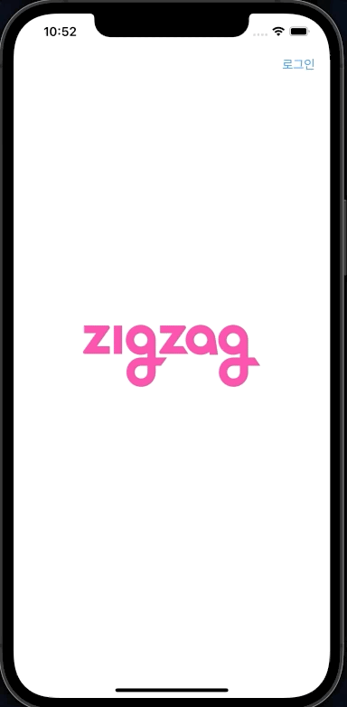
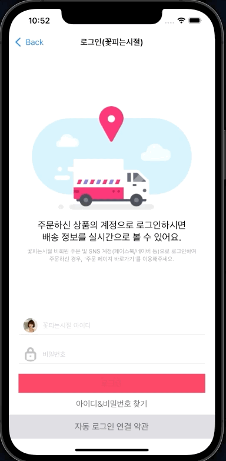
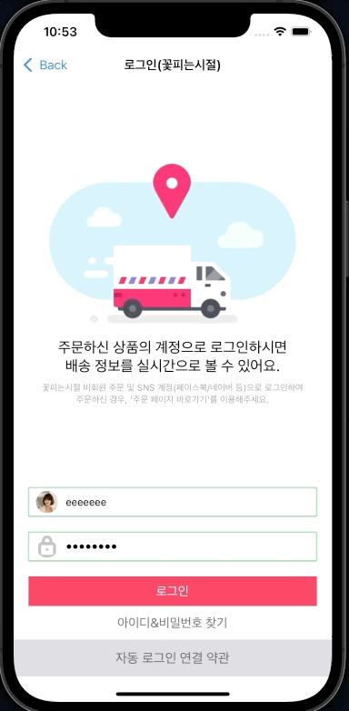
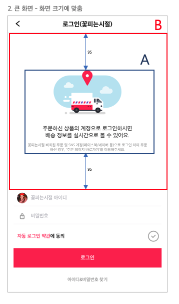
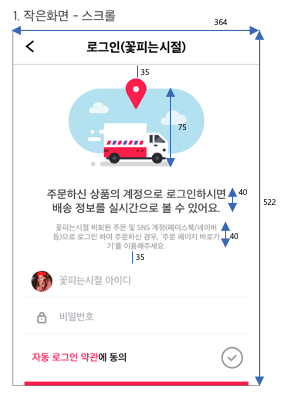
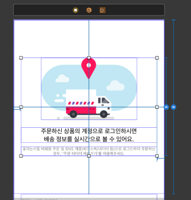
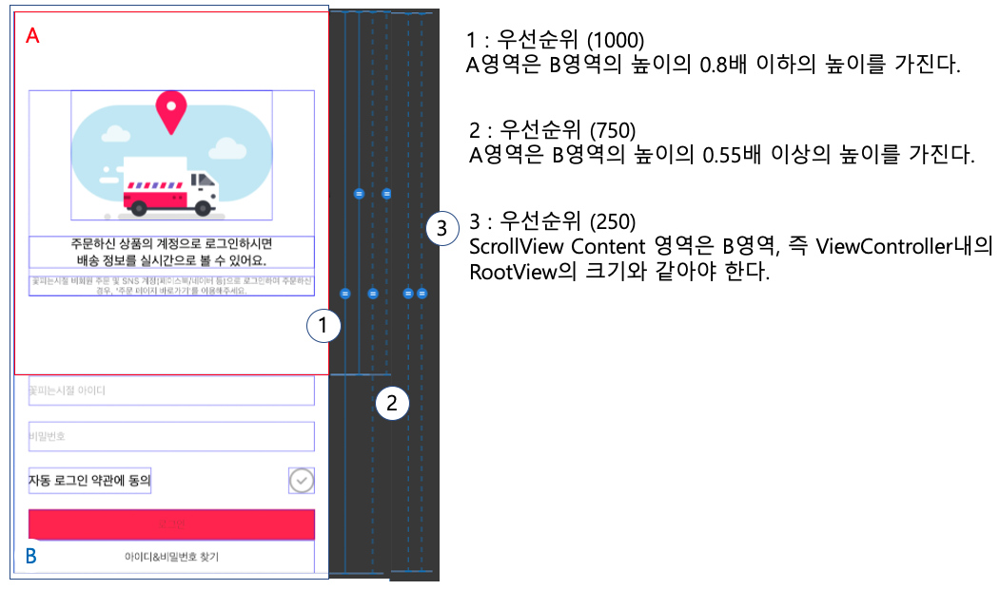
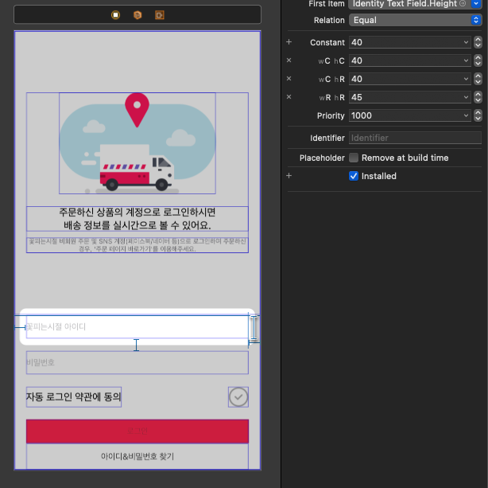

# ZigZag Shop LogIn

> 자동 로그인 동의 여부에 따라 달라질 수 있는 레이아웃 구현하기

<br>

## 목차
- [기능](#기능)
- [구현](#구현)
- [트러블 슈팅](#트러블-슈팅)


<br>

## 미리보기

<p float="left">
  
   
  
</p>

<br>

# 기능


## 자동 로그인 약관 동의


자동 로그인 약관에 동의해야지만, 로그인할 수 있으며, <br>
한 번 동의하였으면 다음 로그인 시도 시 아래 방향으로 약관 동의 버튼이 이동합니다.

<br>

## 자동 로그인 비동의


자동 로그인 약관에 동의해야하는 것을 사용자가 인식할 수 있도록, Alert창을 띄웠습니다.

<br>

## 아이디, 비밀번호 유효성 검사


TextField를 통해서 입력 받은 아이디 값을 조건(6~12 자리, 빈 문자열 포함 x)에 부합하는지 검사하고, <br> 해당 검사를 통과하는지를 TextField 색을 통해서 유저가 쉽게 인지할 수 있게 하였습니다. <br> 또한, 아이디, 비밀번호 모두 통과해야지만 로그인 버튼이 활성화됩니다.

<br>

# 구현

## 레이아웃

구현에 앞서 모든 기기, 회전에 대응하기 위해서 주어진 요구사항 이미지들에 대해서 분석했습니다. 그리고 우선순위를 정한 이후에 논리적으로 AutoLayout Constraint을 설정했습니다.

<p float="left">
    
    
</p>

각 비율을 측정하고 `A` 영역이 `B` 영역 가운데 위치한다는 것을 파악했습니다. 그리고 요구 사항을 보며 우선순위를 세워야 하는 요소들을 파악했습니다.

- 해상도가 높을 경우, 화면에 꽉 채우도록 해야 된다.
- A 영역의 크기는 일정 크기 이상이며, 이로인해 화면에 모두 포함되지 못하면 스크롤을 통해 컨텐츠를 확인해도 된다.

<br>

따라서, 아래에서 볼 수 있듯이 이미지와 정보를 나타내주는 Label들을 담는 컨테이너 역할을 하는 View로 묶어서 가운데로 고정시켰습니다.



<br>

또한, 화면에 꽉 채우면 좋겠지만, 모든 레이아웃 요소들이 일정 크기 이상으로 보여질 수 있도록 Constraint에 우선순위를 주었습니다.



<br>

기기들의 크기를 분류할 수 있는 기준인, Size Class(Compact, Regular)를 통해서 레이아웃 크기를 다르게 측정하기도 하였습니다.



<br>


## 자동 로그인 동의 여부

자동 로그인 동의 여부는 간단하고, 중요도가 낮은 정보이기에 UserDefaults에 Key Value 쌍으로 저장을 하였습니다.

```swift
extension UserDefaults {
    enum Key {
        static let isAutoLogIn = "AutoLogIn"
    }
}
```
그리고 화면으로 처음 진입할 시, `viewDidLoad()` 에서 해당 Value를 확인하여 자동 로그인에 대한 동의 여부를 확인하고, 그에 맞는 레이아웃을 화면에 적용할 수 있도록 하였습니다.

```swift
private func distinguishAutoLogIn() {
    isAgreed = UserDefaults.standard.bool(forKey: UserDefaults.Key.isAutoLogIn)
    if isAgreed {
        deActivateConstraints()
        hideAutoLogInAgreeViews()
        setUpAutoLogInTermsButton()
    }
}
```

<br>

## 아이디 & 비밀번호 유효성 검사

아이디 비밀번호의 경우, (6~12 글자, 빈 문자열 미포함) 등의 조건을 통해 유효한지 아닌지 검사했습니다.

```swift
private func validateLength(_ text: String) -> Bool {
    return (6..<12) ~= text.count
}

private func validateWhiteSpace(_ text: String) -> Bool {
    return text.contains(" ") == false
}
```

<br>

## 로그인 성공

요구사항와 같이 `로그인 성공` 이라는 텍스트를 Label을 통해서 출력하였으며, 기존 앱들의 동작과 동일하게 이전 Main 화면으로 돌아가게 수행하였습니다. 그리고 로그인 성공 이벤트를 Delegate 패턴을 통해서 MainViewController에 전달하였으며, 로그인 버튼을 로그아웃 버튼으로 변경시켰습니다.

```swift
final class LogInViewController: UIViewController {
    //...
    weak var delegate: LogInViewControllerDelegate?
    //...

    @IBAction func touchLogInButton(sender: UIButton) {
        if isAgreed && viewModel.password.value == .valid && viewModel.identity.value == .valid {
            // 자동 로그인에 동의하였으며, ID, PW가 모두 유효할 경우
            UserDefaults.standard.set(true, forKey: UserDefaults.Key.isAutoLogIn)
            changeViewsForLogIn()
            progressLogIn()
        } else {
            alertAutoLogInRequest()
        }
    }

    private func progressLogIn() {
        DispatchQueue.global().asyncAfter(deadline: .now() + 5.0) {
            DispatchQueue.main.async {
                self.backToMainViewController()
            }
        }
    }

    private func backToMainViewController() {
        informationLabel.text = Style.InformationText.success
        guard let identity = identityTextField.text else { return }
        delegate?.didSuccessLogIn(identity: identity)
        navigationController?.popViewController(animated: true)
    }
}
```
<br>

## 로그인 지연

해당 요구사항에 맞게 로그인 시도 시, 5초 지연 이후 성공하도록 하였습니다. 하지만, 해당 동작 중 UI가 멈추지 않도록 비동기적으로 구현하였습니다. 로그인 시도 중에도 이전 화면으로 넘어갈 수 있는 등 다른 작업을 수행할 수 있습니다.

```swift
private func progressLogIn() {
    DispatchQueue.global().asyncAfter(deadline: .now() + 5.0) {
        DispatchQueue.main.async {
            self.backToMainViewController()
        }
    }
}
```
<br>

## 사용성을 높이기 위한 LayoutConstraint 조절

키보드 프레임으로 인해 아이디, 비밀번호 입력 TextField가 가려지지 않도록 해당 프레임 높이만큼 스크롤뷰의 Constraint를 변화시켰습니다.

```swift
@objc private func keyboardWillShow(_ notification: Notification) {
    guard let userInfo = notification.userInfo,
            let endFrameValue = (userInfo[UIResponder.keyboardFrameEndUserInfoKey] as? NSValue) else {
        return
    }
    let endFrame = endFrameValue.cgRectValue
    scrollViewBottomConstraint.isActive = false
    scrollViewBottomConstraint = scrollView.bottomAnchor.constraint(equalTo: view.bottomAnchor,
                                                                    constant: -endFrame.height)
    scrollViewBottomConstraint.isActive = true
    UIView.animate(withDuration: 0.3) {
        self.view.layoutIfNeeded()
    }
}

@objc private func keyboardWillHide(_ notification: Notification) {
    let safeArea = view.safeAreaLayoutGuide
    scrollViewBottomConstraint.isActive = false
    scrollViewBottomConstraint = scrollView.bottomAnchor.constraint(equalTo: safeArea.bottomAnchor)
    scrollViewBottomConstraint.isActive = true
    UIView.animate(withDuration: 0.3) {
        self.view.layoutIfNeeded()
    }
}
```
## MVVM 패턴 사용 이유

MVVM 패턴의 경우 비동기 작업(Networking 등)과 같이 데이터의 흐름을 파악하기 힘든 구조에서 많이 사용됩니다. 또한 View의 Content에 사용될 데이터를 가공하는 ViewModel의 재사용성도 큰 장점입니다. 그러나, 해당 프로젝트는 위 장점들을 살리지는 못합니다. 그렇지만 아이디, 비밀번호 유효성 검사에 대한 로직을 응집시킬 수 있으며, ViewController의 Life Cycle에 의존하지 않게 하여 Unit Test를 진행시킬 수 있다는 점을 고려하여 해당 패턴을 채택했습니다.

ViewModel의 Binding은 Property Observer를 통해서 구현하였으며, `Observerable` 타입을 구현하여 보일러 플레이트 코드를 최소화 시키고자 하였습니다.

```swift
final class Observerable<Element> {
    var value: Element {
        didSet {
            handler?(value)
        }
    }

    private var handler: ((Element) -> Void)?

    init(value: Element) {
        self.value = value
    }

    func bind(_ handler: @escaping (Element) -> Void) {
        self.handler = handler
    }
}
```

<br>

## Test 코드 작성

아이디, 패스워드에 대한 유효성 검사를 하는 `LogInValidator` 타입과 `LogInViewController` 내에 표시될 Model을 가공하는 `LogInViewModel` 에 대해서 Unit Test를 간단하게 진행하였습니다.

- LogInValidator<br>
해당 타입에 대해서는 여러 경우의 수에 대해 올바르게 유효성 검사가 이루어지는지 테스트하였으며, valid 판정 이후 TextField의 모든 문자열을 삭제시켰을 시, 아이디 & 비밀번호 모두 유효한지를 나타내는 `validatedAll()`가 true를 반환되는 버그를 발견하여 수정하였습니다.

- LogInViewModel<br>
Observer 타입의 인스턴스로써 ViewModel의 프로퍼티들이 `Binding`이 제대로 이뤄지고 있는지 확인하는 테스트를  진행하였습니다.

<br>

# Trouble Shooting

## 레이아웃 수정 과정

## TextField underline

요구 사항의 TextField Underline을 표현하기 위해 아래 코드를 구현하였습니다.

```swift
@IBDesignable
final class LogInTextField: UITextField {
    //...
    @IBInspectable
    var underlineColor: UIColor? {
        didSet {
            layer.shadowColor = underlineColor?.cgColor
            layer.shadowOffset = CGSize(width: 0, height: 0.3)
            layer.shadowOpacity = 0.5
            layer.shadowRadius = 0
            layer.backgroundColor = UIColor.white.cgColor
        }
    }
```

하지만. shadow의 경우 런타임 렌더링 과정에서 복잡하고 자원이 많이 들기 때문에, shadowPath를 설정함으로써 최적화가 필요합니다.


`shadowPath`에 대해서 학습 하던 중 `CGPath`, `UIBezierPath` 타입에 대해서 인식하게 되어, 해당 타입을 통해서 draw 메소드 내에서 underline이 그려지도록 구현하였습니다.

```swift
override func draw(_ rect: CGRect) {
    super.draw(rect)
    let path = UIBezierPath()
    path.lineWidth = 0.3
    path.move(to: CGPoint(x: 0, y: bounds.height - 1))
    path.addLine(to: CGPoint(x: bounds.width, y: bounds.height - 1))
    underlineColor?.set()
    path.close()
    path.stroke()
} 
```

<br>

